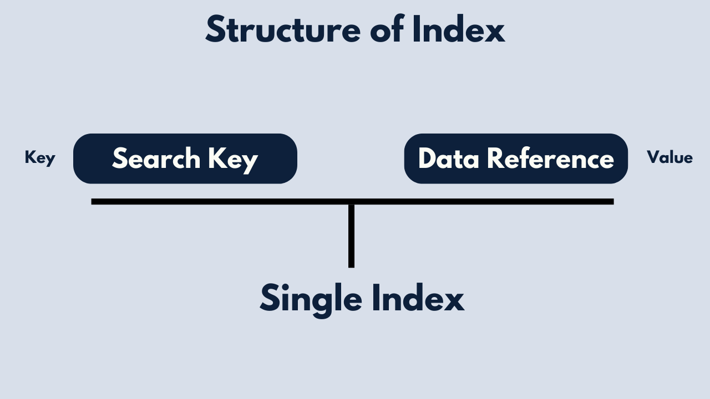
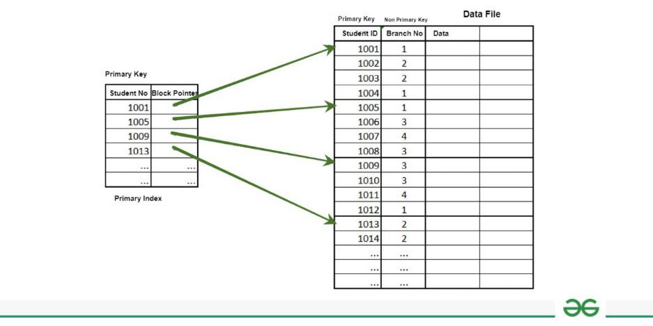
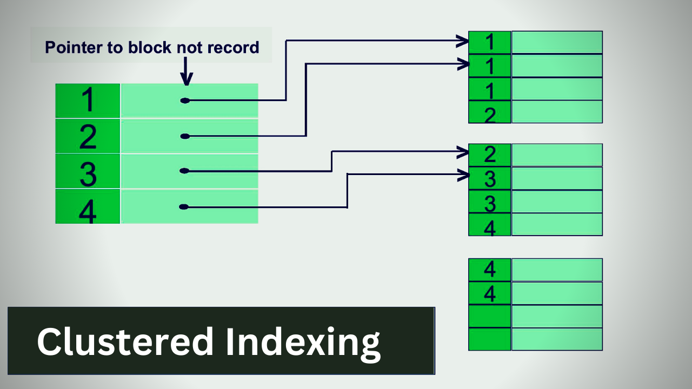
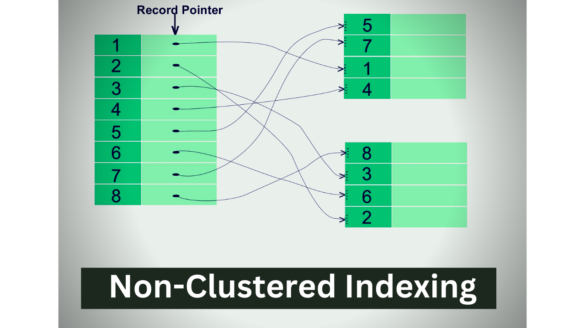

# How do indexes make databases read faster?

First lets understand how data is stored on disk.

# Data Blocks

The actual contents of files are stored in data blocks scattered across the disk. When a file is saved, the file system allocates a series of contiguous or non-contiguous blocks to store its data. These blocks may not be physically adjacent on the disk but are logically linked together through pointers in the file's metadata.


# Indexing

In database management systems (DBMS), indexing is a technique used to improve the speed of data retrieval operations on tables or views. It involves creating data structures known as indexes, which store pointers or references to rows in a table sorted based on the values of one or more columns. Here's how indexing works in DBMS.

# Index Structure

An index typically consists of two parts: the index key and the pointer to the corresponding data. The index key is the column or columns on which the index is built, and the pointer is a reference to the actual row in the table. Indexes can be built on single columns or on multiple columns (composite indexes).



# Types of Indexes :-

## Primary Indexing
A Primary Index is an ordered file whose records are of fixed length with two fields. The first field of the index is the primary key of the data file in an ordered manner, and the second field of the ordered file contains a block pointer that points to the data block where a record containing the key is available.

[For more in depth](https://www.geeksforgeeks.org/primary-indexing-in-databases/)



### Types of Primary Indexing

- Dense Indexing: In Dense Index has an index entry for every search key value in the data file. This approach ensures efficient data retrieval but requires more storage space.

```
No of Index Entry = No of DB Record
```

- Sparse Indexing: Sparse indexing involves having fewer index entries than records. The index entries point to blocks of records rather than individual records. While it reduces storage overhead, it may require additional disk accesses during retrieval.

```
No of Index Entry is not equal to No of Block
```
# Secondary Indexing
Secondary indexing is a database management technique used to create additional indexes on data stored in a database. The main purpose of secondary indexing is to improve the performance of queries and to simplify the search for specific records within a database. A secondary index provides an alternate means of accessing data in a database, in addition to the primary index. The primary index is typically created when the database is created and is used as the primary means of accessing data in the database. Secondary indexes, on the other hand, can be created and dropped at any time, allowing for greater flexibility in managing the database.

[For more in depth](https://www.geeksforgeeks.org/secondary-indexing-in-databases/)

# Clustered Index
A clustered index is an index that describes the physical configuration of the table records in a database. Since there is only one-way records can be kept physically in a database table, each table can only have one clustered index. It keeps the data in sorted order

[For more in depth](https://www.boardinfinity.com/blog/clustered-and-non-clustered-index/)



# Non-Clustered Index
The physical arrangement of the records kept in the database table is not specified by a non-clustered index. A separate table houses the Non-Clustered Indexes. There may be many non-clustered indexes created for a single table as a result of the fact that they are maintained in a different table.




# Creating Indexes

Indexes can be created explicitly by database administrators or automatically by the DBMS based on query patterns and access patterns. However, creating indexes incurs overhead in terms of storage space and maintenance, so it's essential to carefully consider which columns to index.

# Query Optimization

When processing a query, the DBMS's query optimizer decides whether and how to use indexes based on factors such as the query's predicates, the availability of suitable indexes, and the cost of accessing data through indexes versus full table scans.

# Trade-offs

While indexes can significantly improve query performance, they also come with trade-offs, including increased storage requirements, overhead in write operations, and potential for index fragmentation.
